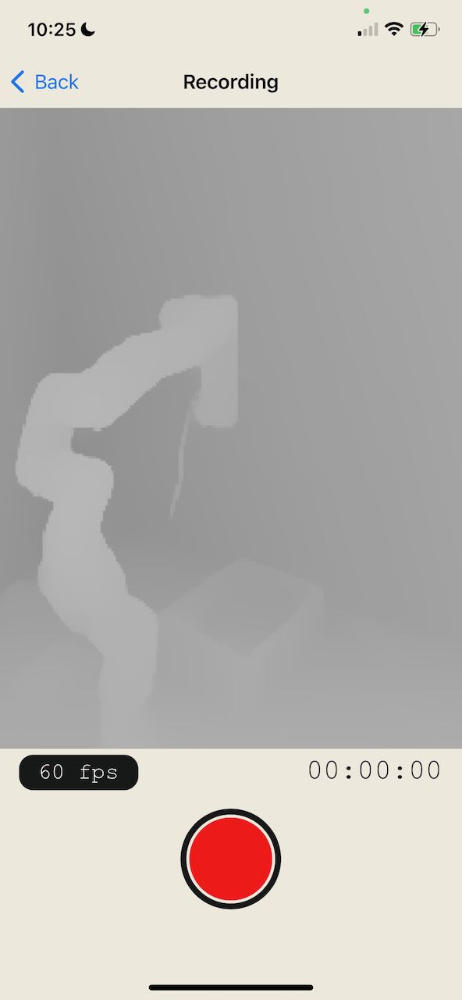

# Stray Scanner App

The goal of this app, is to allow easy access to raw RGB-D video datasets recorded using LiDAR enabled iOS devices. The app can be downloaded for free [on the iOS App Store](https://apps.apple.com/us/app/stray-scanner/id1557051662).

## Usage

Documentation can be found under the [docs](docs/) directory. The document [docs/format.md](docs/format.md) describes the data format and conventions used in the app.

## Related projects

- [StrayVisualizer](https://github.com/kekeblom/StrayVisualizer): a project to visualize the raw data collected by the app
- [MATLAB Scripts](https://github.com/PyojinKim/StrayScannerVisualizer): a set of tools to work with the data format in Matlab
- [Autolabel](https://github.com/ethz-asl/autolabel): an interactive volumetric labeling tool

## Contributing

Contributions are welcome. To contribute, simply open a pull request.

Some ideas for improvements include:
- Better scan viewer
- Better ways to organize scans, e.g. through tags
- Recording other modalities, such as audio, Wifi or GPS
- Direct upload to cloud services or S3

